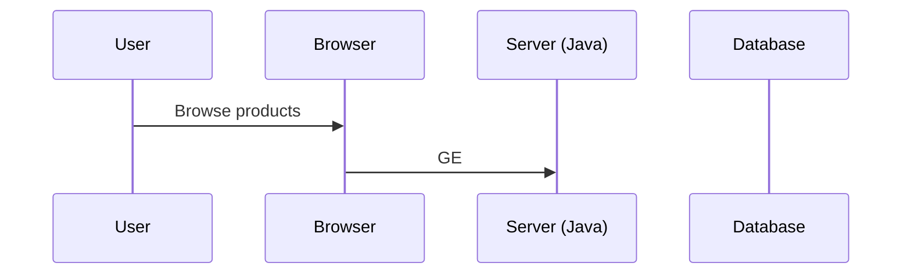

╔══════════════════════════════════════════════════════════════╗
║                                                              ║
║   ███████╗ ██████╗ ██████╗ ███╗   ███╗███╗   ███╗███████╗  ║
║   ██╔════╝██╔════╝██╔═══██╗████╗ ████║████╗ ████║██╔════╝  ║
║   █████╗  ██║     ██║   ██║██╔████╔██║██╔████╔██║█████╗    ║
║   ██╔══╝  ██║     ██║   ██║██║╚██╔╝██║██║╚██╔╝██║██╔══╝    ║
║   ███████╗╚██████╗╚██████╔╝██║ ╚═╝ ██║██║ ╚═╝ ██║███████╗  ║
║   ╚══════╝ ╚═════╝ ╚═════╝ ╚═╝     ╚═╝╚═╝     ╚═╝╚══════╝  ║
║                                                              ║
║   ╔═╗╔═╗╔═╗ ╔═╗╔═╗╔╗╔╔═╗╔═╗╔╦╗╦═╗╔═╗╔╦╗╔═╗                ║
║   ║ ║╚═╗║  ║ ║║ ║║║║║ ╦╠═╣ ║ ╠╦╝╠═╣ ║ ║ ║                ║
║   ╚═╝╚═╝╚═╝╚═╝╚═╝╝╚╝╚═╝╩ ╩ ╩ ╩╚═╩ ╩ ╩ ╚═╝                ║
║                                                              ║
║         🛒  Full-Stack E-Commerce Application  🛒             ║
║            HTML Frontend · Java Backend · SQL                ║
║                                                              ║
╚══════════════════════════════════════════════════════════════╝

[](https://github.com/shubhyagami/eCommerce/actions)
[](https://opensource.org/licenses/MIT)
[](https://github.com/shubhyagami/eCommerce)

---

## 🚀 Project Description

**eCommerce** is a modern, full-stack web application that brings the complete online shopping experience to life. From browsing products to secure checkout, every step is crafted with clean HTML frontends and a robust Java backend. Whether you're a small business launching your first store or a developer looking for a reference architecture, this project is your blueprint for scalable e-commerce.

Built with simplicity and performance in mind, it uses **Java Servlets** and **JSP** for server-side logic, a **relational database** for inventory management, and **vanilla HTML/CSS/JS** for a responsive, lightweight user interface.

---

## ✨ Feature Highlights

- 🛍️ **Product Catalog** – Browse by category, price, or popularity.
- 🔍 **Smart Search & Filters** – Find exactly what you need in seconds.
- 🛒 **Interactive Shopping Cart** – Add, remove, and update quantities live.
- 💳 **Secure Checkout** – Mock payment integration with order summary.
- 📦 **Order Tracking** – Real-time status updates for every purchase.
- 👤 **User Accounts** – Register, login, and manage your profile.
- 🔐 **Authentication & Authorization** – Role-based access (admin/user).
- 📊 **Admin Dashboard** – Manage products, view orders, and analyze sales.
- 🌐 **RESTful API** – Clean separation between frontend and backend.

---

## 🔧 How It Works



---

## 🚀 Quick Start Guide

Get your local development environment up and running in three easy steps:

1. **Clone the repository**  
   ```bash
   git clone https://github.com/shubhyagami/eCommerce.git
   cd eCommerce
   ```

2. **Set up the database**  
   - Create a MySQL database (e.g., `ecommerce_db`).  
   - Run the SQL scripts located in `/database/init.sql` to create tables and seed sample data.

3. **Launch the application**  
   - Configure database credentials in `src/main/resources/application.properties`.  
   - Build and deploy using Maven:  
     ```bash
     mvn clean package
     mvn tomcat7:run
     ```  
   - Open your browser and navigate to `http://localhost:8080/eCommerce`.

That's it! You can now browse products, add items to the cart, and test the checkout flow.

---

## 📅 Changelog

**2026-07-25** – v2.3.0 “Checkout Refresh”  
- 🆕 Added multi-currency support for international customers.  
- 🐛 Fixed cart persistence bug when session expires.  
- ⚡ Optimized product search query – 40% faster results.  
- 🧹 Refactored admin dashboard UI for better responsiveness.  
- 📚 Updated API documentation with new endpoints.

---

## 💡 Pro Tips

- **Use environment variables** for sensitive data like database passwords – never hardcode them.  
- **Enable caching** on product listings to reduce database load; Redis integration is already in the roadmap.  
- **Test with different roles** – create a test user and an admin account to explore all features.  
- **Customize the theme** – all CSS is under `webapp/css/`; modify variables for a brand look.

---

> *“The best way to predict the future is to build it – one commit at a time.”*  
> – Adapted from Peter Drucker

---

## 🤝 Contributing

Found a bug or have a feature idea? Open an issue or submit a pull request.  
We welcome contributions that improve code quality, add tests, or enhance the user experience.

---

## 📄 License

This project is licensed under the MIT License – see the [LICENSE](LICENSE) file for details.