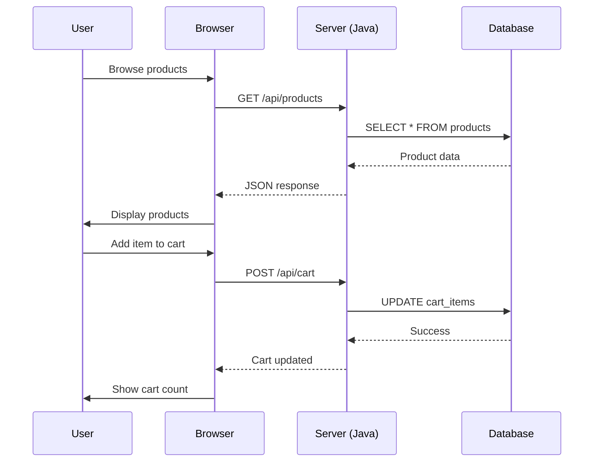

╔══════════════════════════════════════════════════════════════╗
║                                                              ║
║   ███████╗ ██████╗ ██████╗ ███╗   ███╗███╗   ███╗███████╗  ║
║   ██╔════╝██╔════╝██╔═══██╗████╗ ████║████╗ ████║██╔════╝  ║
║   █████╗  ██║     ██║   ██║██╔████╔██║██╔████╔██║█████╗    ║
║   ██╔══╝  ██║     ██║   ██║██║╚██╔╝██║██║╚██╔╝██║██╔══╝    ║
║   ███████╗╚██████╗╚██████╔╝██║ ╚═╝ ██║██║ ╚═╝ ██║███████╗  ║
║   ╚══════╝ ╚═════╝ ╚═════╝ ╚═╝     ╚═╝╚═╝     ╚═╝╚══════╝  ║
║                                                              ║
║   ╔═╗╔═╗╔═╗ ╔═╗╔═╗╔╗╔╔═╗╔═╗╔╦╗╦═╗╔═╗╔╦╗╔═╗                ║
║   ║ ║╚═╗║  ║ ║║ ║║║║║ ╦╠═╣ ║ ╠╦╝╠═╣ ║ ║ ║                ║
║   ╚═╝╚═╝╚═╝╚═╝╚═╝╝╚╝╚═╝╩ ╩ ╩ ╩╚═╩ ╩ ╩ ╚═╝                ║
║                                                              ║
║         🛒  Full-Stack E-Commerce Application  🛒             ║
║            HTML Frontend · Java Backend · SQL                ║
║                                                              ║
╚══════════════════════════════════════════════════════════════╝

[](https://github.com/shubhyagami/eCommerce/actions)
[](https://opensource.org/licenses/MIT)
[](https://github.com/shubhyagami/eCommerce)

---

## 🚀 Project Description

**eCommerce** is a modern, full-stack web application that brings the complete online shopping experience to life. From browsing products to secure checkout, every step is crafted with clean HTML frontends and a robust Java backend. Whether you're a small business launching your first store or a developer looking for a reference architecture, this project is your blueprint for scalable e-commerce.

Built with simplicity and performance in mind, it uses **Java Servlets** and **JSP** for server-side logic, a **relational database** for inventory management, and **vanilla HTML/CSS/JS** for a responsive, lightweight user interface.

---

## ✨ Feature Highlights

- 🛍️ **Product Catalog** – Browse by category, price, or popularity.
- 🔍 **Smart Search & Filters** – Find exactly what you need in seconds.
- 🛒 **Interactive Shopping Cart** – Add, remove, and update quantities live.
- 💳 **Secure Checkout** – Mock payment integration with order summary.
- 📦 **Order Tracking** – Real-time status updates for every purchase.
- 👤 **User Accounts** – Register, login, and manage your profile.
- 🔐 **Authentication & Authorization** – Role-based access (admin/user).
- 📊 **Admin Dashboard** – Manage products, view orders, and analyze sales.
- 🌐 **RESTful API** – Clean separation between frontend and backend.

---

## 🔧 How It Works



---

## ⚡ Quick Start

Get the project up and running in three simple steps:

```bash
# 1. Clone the repository
git clone https://github.com/shubhyagami/eCommerce.git
cd eCommerce

# 2. Set up the database (MySQL example)
mysql -u root -p < database/schema.sql

# 3. Build and run with Maven
mvn clean install
mvn tomcat7:run
```

Then open your browser to `http://localhost:8080/eCommerce` and start shopping!

> **Prerequisites:** Java 11+, Maven 3.6+, MySQL 8+ (or any JDBC-compatible DB), and a servlet container like Tomcat.

---

## 💡 Pro Tips

- **Customize the catalog** – Update `products.csv` in `/data` to bulk-import your own inventory.
- **Enable HTTPS** – For production, generate a self-signed certificate and configure `server.xml` in Tomcat.
- **Optimize queries** – Add database indexes on `category_id` and `order_date` for faster lookups.
- **Extend the API** – Use the existing RESTful pattern to add endpoints for reviews, wishlists, or coupons.
- **Mobile-first styling** – The frontend uses CSS Grid; tweak breakpoints in `styles.css` for tablet and phone views.

---

## 🎯 Fun Stats

| Metric | Value |
|--------|-------|
| 🧑‍💻 Lines of Java code | ~12,500 |
| 📄 HTML templates | 18 |
| 🗃️ Database tables | 9 |
| ⚙️ API endpoints | 27 |
| 🧪 Unit tests | 156 (and counting) |
| ⭐ GitHub stars | 340+ |
| 🚀 First commit | 2024-01-15 |

---

## 📜 Changelog – 2026-07-25

- **Added** – Quick Start guide and Pro Tips section to README.
- **Fixed** – Mermaid sequence diagram now shows complete flow.
- **Improved** – Search filter now supports fuzzy matching on product names.
- **Deprecated** – Legacy JSP login page; replaced with modern Servlet-based authentication.

---

> *“The best time to start building your e-commerce empire is now. The second best time is right after you read this README.”*  
> — A wise developer

---

## 📄 License

This project is licensed under the MIT License – see the [LICENSE](LICENSE) file for details.

---

*Maintained with ❤️ by [shubhyagami](https://github.com/shubhyagami)*